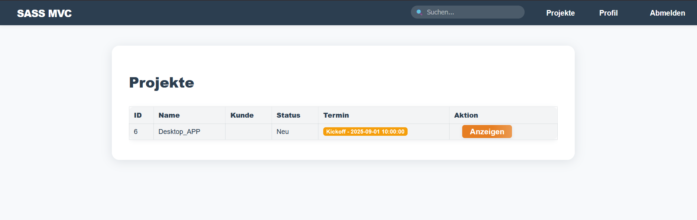

<!-- filepath: d:\SASS\php-sass-starter\README.md -->

# PHP + SASS Starter

Dieses kleine Projekt enthält ein Beispiel für eine mit PHP bereitgestellte Seite und CSS, das mit SASS kompiliert wird.

Voraussetzungen

- PHP (7.4+ empfohlen)
- Node.js und npm (für SASS CLI) oder Dart Sass Binary

Installation und Nutzung (Beispiel unter WSL)

1. In das Projektverzeichnis wechseln

```bash
cd /mnt/d/SASS/php-sass-starter
```

2. Node-Abhängigkeiten installieren

```bash
npm install
```

3. SASS-Kompilierung ausführen

- Einmalige Kompilierung:

```bash
npm run sass
```

- Entwicklung (Beobachten):

```bash
npm run sass:watch
```

4. PHP-Entwicklungsserver starten

```bash
php -S localhost:8000 -t public
```

5. Im Browser öffnen: http://localhost:8000

Hinweise

- Das kompilierte CSS wird in `public/css/style.css` erstellt.
- Falls Node nicht vorhanden ist, kann die Dart Sass Binary verwendet werden: https://sass-lang.com/install

Neue Funktionen (Zusammenfassung)

- Navbar: moderne Suchleiste, statusbasierte Links (`Anmelden`/`Registrieren` oder `Profil`/`Abmelden`).
- Login erforderlich: Für Projektinhalte (Docs) und Suchergebnisse ist ein Login notwendig.
- Weiterleitung: Nach Login/Registrierung automatische Rückkehr zur angeforderten Seite.
- Profil: Benutzerinformationen anzeigen und aktualisieren (Passwort optional).
- Letztes Login: Bei erfolgreichem Login wird `son_giris_tarihi` aktualisiert und im Profil angezeigt.
- Docs-Browser: Listet Ordner/Dateien unter `README/` auf; wandelt Markdown in HTML um.
- Docs-Extras: Breadcrumbs, Überschriften-Anker und Inhaltsverzeichnis (TOC), Sticky-Seitenleiste.
- Suche: Volltextsuche in `README/` mit Snippets; klickbare Dateilinks.
- In-Page-Suche: Hervorhebung im Menü und Inhalt beim Tippen (per JS).
- SASS: `lighten()/darken()`-Aufrufe wurden durch `color.adjust()` aus dem `sass:color`-Modul ersetzt.

Routen

- `GET /index.php` → Startseite (README-Ordner im linken Menü)
- `GET /index.php?action=docs&path=...` → Dokumentenordner oder Markdown-Datei
- `GET /index.php?action=search&q=...` → Suche in README (Login erforderlich)
- `GET|POST /index.php?action=login` → Login (bei Erfolg Weiterleitung)
- `GET|POST /index.php?action=register` → Registrierung (bei Erfolg automatischer Login + Weiterleitung)
- `GET /index.php?action=profile` → Profil
- `GET|POST /index.php?action=update` → Daten aktualisieren
- `GET /index.php?action=logout` → Abmelden

Zugriff und Weiterleitung

- Docs- und Suchseiten erfordern Login. Ohne Login erscheint die Seite „Zugriff erforderlich“.
- Die angeforderte URL wird als `redirect_after_login` in der Session gespeichert und nach Login/Registrierung automatisch weitergeleitet.
- Zusätzlich wird bei „Anmelden/Registrieren“-Links der Parameter `next=/...` angehängt, was die Weiterleitung ermöglicht.

Passwort-Policy

- Mindestens 12 Zeichen.
- Mindestens 1 Großbuchstabe, 1 Kleinbuchstabe, 1 Zahl, 1 Sonderzeichen.
- Wird bei Registrierung und Profilaktualisierung (wenn Passwortfeld ausgefüllt ist) geprüft.

Datenbank (MySQL)

- Verbindung: In `app/models/UserModel.php` ist `dbname=sass`, Benutzer `root`, Passwort leer (lokal ggf. anpassen).
- Erwartete Tabelle:
  ```sql
  CREATE TABLE users (
    id INT AUTO_INCREMENT PRIMARY KEY,
    adi VARCHAR(100) NOT NULL,
    soyadi VARCHAR(100) NOT NULL,
    mail VARCHAR(190) NOT NULL UNIQUE,
    sifre VARCHAR(255) NOT NULL,
    olusturma_tarihi DATETIME NOT NULL,
    guncelleme_tarihi DATETIME NOT NULL,
    son_giris_tarihi DATETIME NULL
  ) ENGINE=InnoDB DEFAULT CHARSET=utf8mb4;
  ```
- Falls die Spalte `son_giris_tarihi` fehlt, hinzufügen:
  ```sql
  ALTER TABLE users ADD COLUMN son_giris_tarihi DATETIME NULL;
  ```

Docs-Viewer (README/)

- Beginnt im Wurzelverzeichnis `README/`, listet Unterordner und `.md`-Dateien auf.
- Markdown-Unterstützung: Überschriften (h1–h6), Listen, Links, Bilder, einfache Tabellen, Inline-/Codeblöcke.
- Überschriften erhalten automatisch eine `id`; TOC und Breadcrumbs sind rechts/links angeordnet.
- Windows- und Linux-Pfade werden normalisiert; Links verwenden Vorwärtsschrägstrich (`/`).

Suchfunktionen

- Mit der Suchleiste in der Navbar kann eine Volltextsuche in README durchgeführt werden (Login erforderlich).
- Ergebnisse zeigen den Dateinamen „lesbar“ an, darunter den echten Pfad und die Trefferanzahl.
- Ergebnislinks öffnen die `docs`-Seite mit dem richtigen `path`; In-Page-Highlighting bleibt erhalten.

SASS-Hinweise

- Das `sass:color`-Modul wird verwendet, `color.adjust()` ist bevorzugt.
- Body-Horizontal-Padding ist responsive: 10px → 16px (≥640px) → 24px (≥1024px) → 32px (≥1280px).
- CSS kompilieren: `npm run sass` oder zum Beobachten `npm run sass:watch`.

Bekannte Einschränkungen

- Der Markdown-Konverter ist einfach; möglicherweise werden nicht alle Markdown-Features unterstützt.
- Weiterentwicklungsidee: Aktive TOC-Hervorhebung in Überschriften, Baumansicht im Docs-Menü, erweiterter Markdown-Support.

Screenshots




Hinweis: Legen Sie die Screenshots unter `public/img/` ab; sie werden automatisch über die obigen Pfade geladen.

Verzeichnisstruktur (Übersicht)

```
php-sass-starter/
├─ app/
│  ├─ controllers/
│  │  └─ HomeController.php
│  ├─ models/
│  │  └─ UserModel.php
│  └─ views/
│     ├─ nav-bar.php, home.php, login.php, register.php, profile.php, update.php
│     ├─ docs.php, search.php, auth-required.php
├─ public/
│  ├─ index.php
│  ├─ css/ (SASS-Ausgabe)
│  ├─ js/  (search.js)
│  └─ img/ (Screenshots — Ihre eigenen)
├─ README/ (Dokumentenordner und .md-Dateien)
├─ scss/ (style.scss)
├─ package.json
└─ README.md (diese Datei)
```
